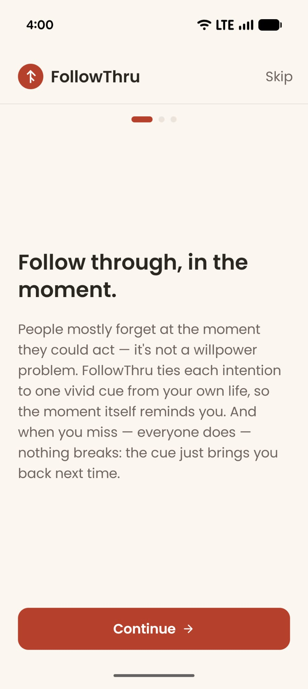
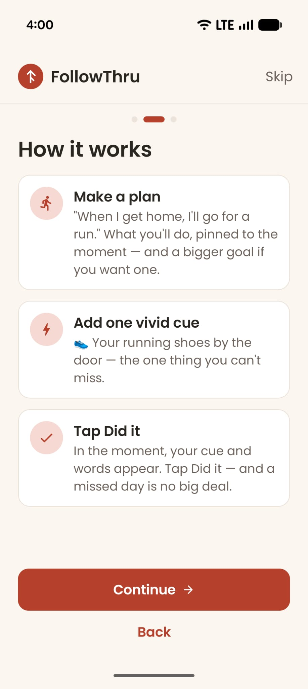
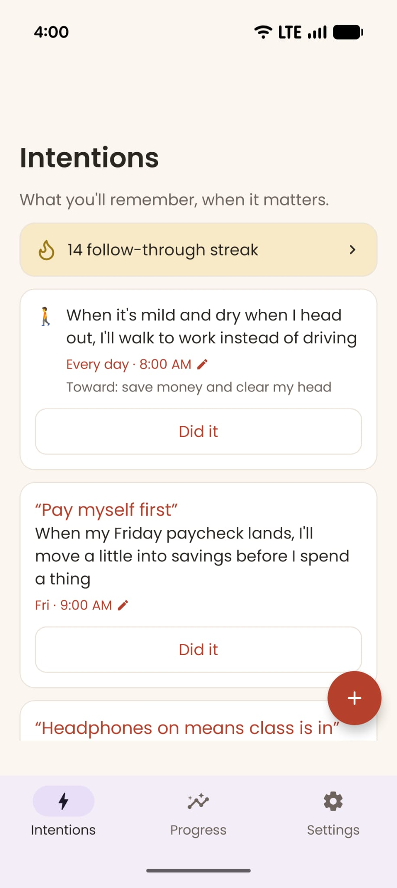
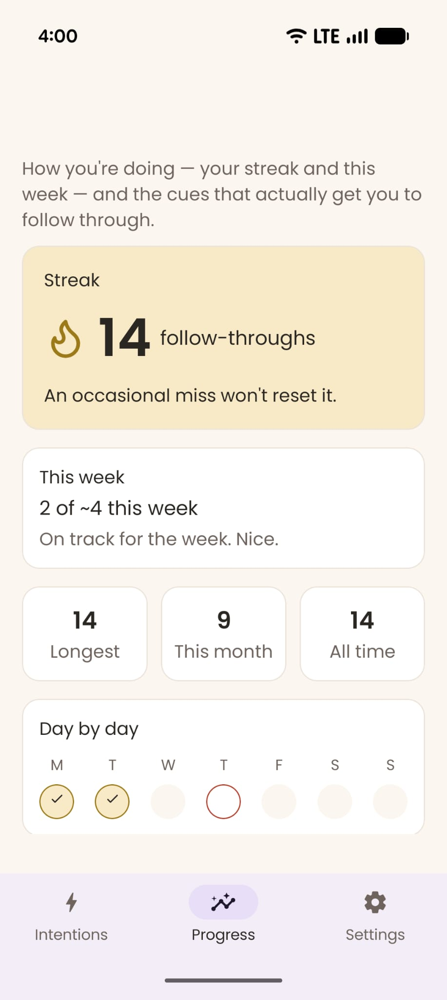
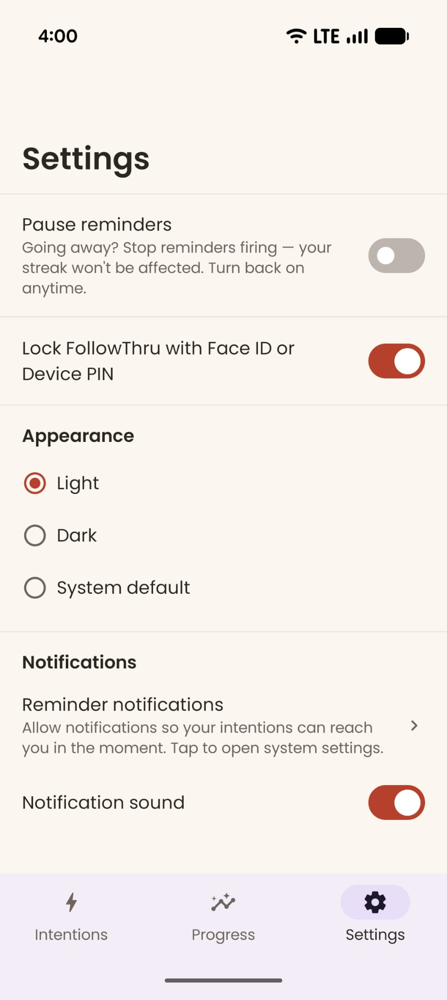

# FollowThru

A privacy-first Android app that helps you **remember to act on your intentions at the moment that matters** — by tying each one to a single, distinctive cue from your own life.

Live on Google Play (package `com.ideasinc.followthrough`).

## What it is

The current release is a **free, local-only MVP with no AI** — no accounts, no cloud, no tracking. You capture an intention, design one distinctive cue for it, choose when it should surface, and log whether you acted. Everything stays on your device.

The product loop, in one line:
**set an intention → design one cue → choose when it surfaces → it fires in the moment → you log it → you see what worked.**

## How it works

Three tabs:

- **Intentions** — your active intentions; create new ones; respond in one tap (**Did it**, undoable). A missed cue is simply not done — never held against you.
- **Progress** — how you're doing: a forgiving weekly-cadence streak (flexibility beats rigidity), an honest "this week" ratio, a Mon–Sun grid, and below it the cues that actually drove your follow-through so you can see what works and reuse it. Flexible and forgiving, but honest — never guilt.
- **Settings** — theme (light/dark/system), notifications, app lock, privacy.

Creating an intention is a short **create-cue flow**: name the intention → pin the moment (daily, weekly, or just once) → design the cue → review. When the moment arrives, a high-priority notification surfaces the cue plus the full intention text; tapping it opens a focused **in-the-moment** screen with the single **Did it** response.

## Screenshots

  
  
  
  
  

## Tech

Native **Kotlin / Jetpack Compose / Material 3**, local **Room** persistence, **AlarmManager** for reliable delivery (survives Doze, battery optimization, and reboot). No backend, no analytics SDKs.

## Reference docs

- `docs/references/Product_Strategy.md` — product strategy / vision (the phased rollout; the future paid AI tier)
- `docs/references/MVP_User_Flow_IA.md` — the MVP's navigation, screens, create-cue flow, and vocabulary (the build spec)
- `docs/references/Customer Feedback.csv` — raw beta feedback grounding the IA
- `CLAUDE.md` — working rules and hard constraints
- `BRAND_STYLE_GUIDE.md` — color, type, and iconography source of truth

## Privacy

Everything you create lives only on your device — never uploaded, and not visible to the developer. There is no backup: uninstalling, resetting, or switching devices means the data can't be recovered. See `privacy-policy.html`.

> Note: the internal package and some code use the legacy name "Grounded"; this is intentional and kept for Play Console continuity. The app name everywhere user-facing is **FollowThru**.
