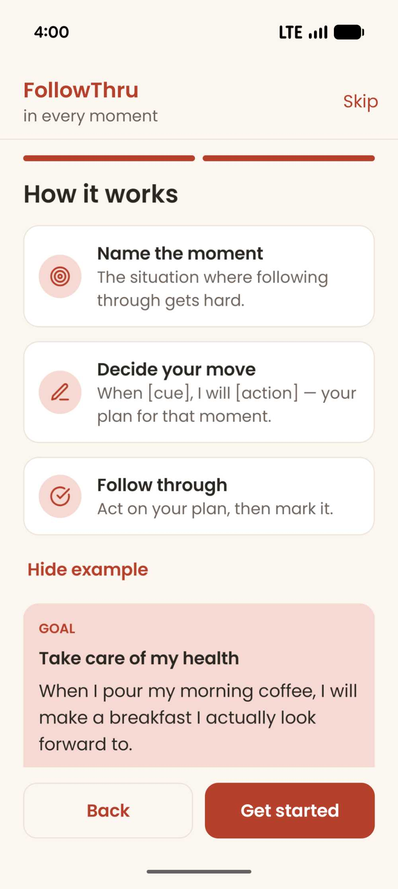
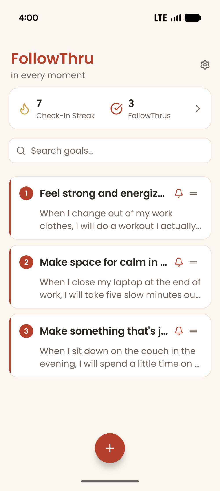
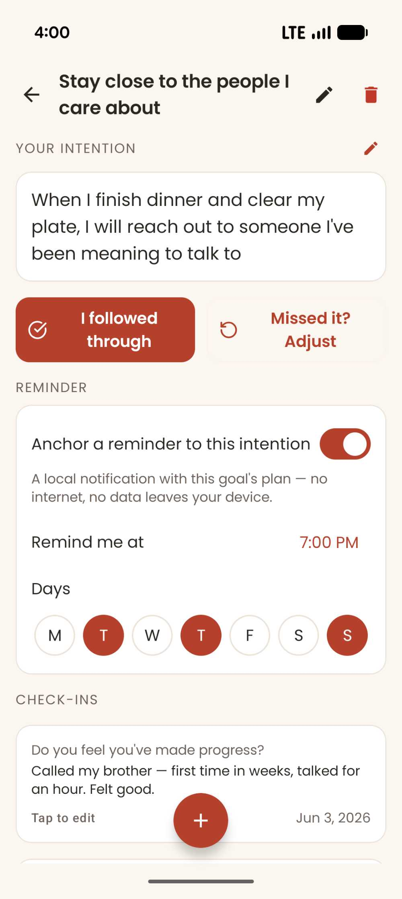
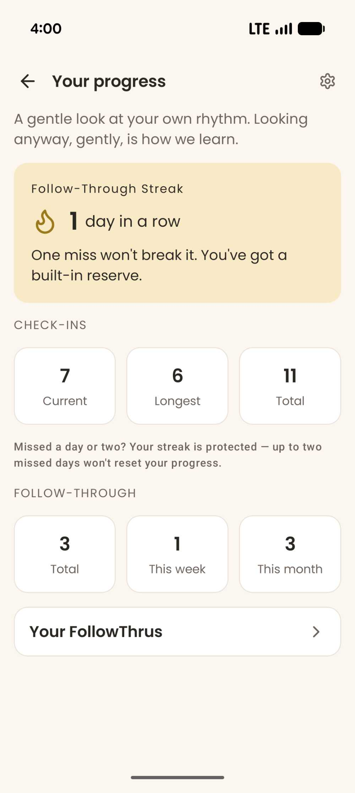

# FollowThru

**in every moment**

A privacy-first Android app for following through on what matters. FollowThru helps you turn intentions into action in the moment — and reflect, privately, on what actually works for you.

<!-- Add four screenshots to docs/screenshots/ and they'll appear here -->

  
  
  
  

## The idea

Following through is rarely a willpower problem — more often we simply forget in the moment that matters. FollowThru is built around two small, well-studied ideas: pairing a goal with a clear *implementation intention* ("when X happens, I will do Y"), and a distinctive, in-the-moment reminder anchored to that intention. You decide what to do and when; the app just helps you remember, and notice what's working.

## Features

- **Goals with an implementation intention** — name what you're working toward and the "when… I will…" plan that triggers it.
- **Per-goal reminders** — anchor a local reminder to a specific intention, on the days and time you choose; tapping it opens that goal.
- **Private reflection** — short, optional check-ins to capture progress and what's helping, in your own words.
- **Streaks & your follow-throughs** — a check-in streak and a record of the times you followed through.
- **Light / Dark / System** themes, plus an optional app lock (biometric or device PIN).

## Privacy first

FollowThru runs **entirely on your device**. No accounts, no sign-in, no servers, no analytics, no ads, no cloud sync. Everything you enter stays on your phone and never leaves it — and because the code is open, you can verify that for yourself. Reminders are local notifications generated on-device.

Read the [Privacy Policy](https://timothydeas.github.io/follow-through/privacy-policy.html).

## Built with

Kotlin · Jetpack Compose · Material 3 · Room (local database) · no network layer, by design.

## License

<!-- TODO: pick a license (e.g. MIT) if you want others to reuse the code. Without one, default copyright ("all rights reserved") applies even on a public repo. -->
