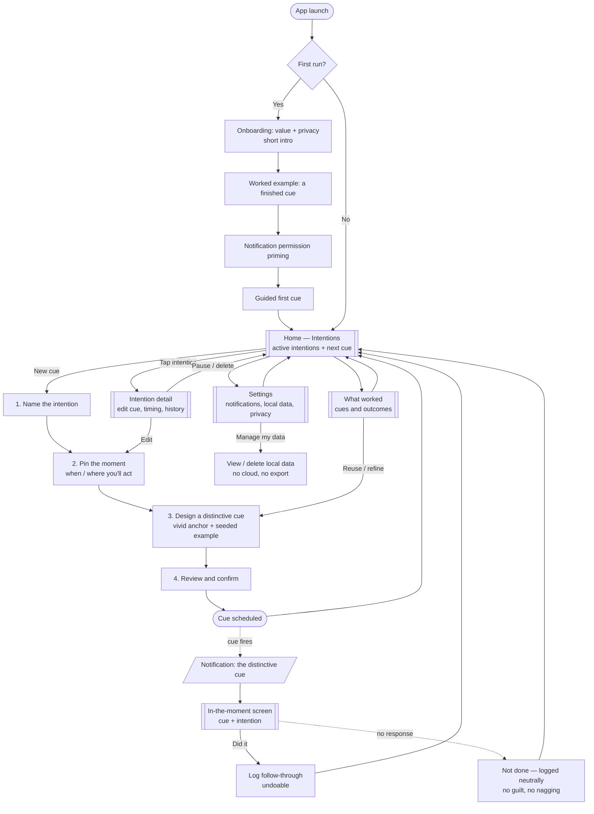

# MVP — User Journey, Information Architecture & User Flow

Handoff spec for build. Scope: the **free, local-only, no-AI MVP**. No accounts, no cloud, no telemetry.

---

## 1. Design principles (the guardrails every screen must satisfy)

- **Local-only** — all data on device; no accounts, no network for personal content.
- **Autonomy-first** — every cue is user-defined and dismissible. No guilt and no failure framing; a missed cue is simply logged neutrally and never held against the user.
- **The distinctive cue is the hero** — the create flow's center of gravity is helping the user make a cue vivid and memorable, not just set a generic alert.
- **Show, don't tell** — purpose and expectations are demonstrated with a concrete worked example, never explained abstractly. (The single loudest beta signal was "I didn't know what this was for or where to start.")
- **Frictionless in the moment** — responding to a fired cue is one tap.
- **Accessible by default** — WCAG 2.1 AA: TalkBack labels, dynamic type, 48dp targets, visible focus, AA contrast.
- **Adaptive** — phone: bottom nav, single column. Tablet: nav rail + two-pane (list ↔ detail).

---

## 2. Information Architecture

Three primary destinations, plus the in-the-moment surface (which is reached from a notification, not a tab).

```
App
├── Intentions  (home / default tab)
│   ├── Intention list  (active intentions; next cue surfaced at top)
│   ├── Empty state  (first-time: one clear "create your first cue" CTA)
│   └── Intention detail  (view/edit intention, its cue, its timing, its history)
├── What worked  (tab)
│   └── History of cues × outcomes; reuse or refine the cues that drove follow-through
├── Settings  (tab)
│   ├── Notifications
│   ├── My data  (view / delete local data — no cloud, no export)
│   └── Privacy & about
└── In-the-moment screen  (entered from a notification)
    └── Distinctive cue + intention → a single response: Did it
```

---

## 3. Core user flows

1. **First run / onboarding** — a short intro (what it does, the privacy promise, the distinctive-cue idea) → **a worked example** (one finished intention + its distinctive cue + what "done" looks like, so the user sees the payoff before building their own) → notification permission priming → straight into creating the first cue (this first cue = the activation moment).
2. **Create a cue (hero flow)** — progressive disclosure, one decision per step:
   1. Name the intention — "What do you want to remember to do?"
   2. Pin the moment — when/where you'll be able to act.
   3. Design a distinctive cue — the creative core; push past generic text toward a vivid, specific anchor. **Seed the step with a concrete example** ("when I pour my morning coffee → running shoes by the door") so the user isn't facing a blank, abstract prompt — this is the step most likely to stall.
   4. Review & confirm → scheduled.
3. **In-the-moment cue** — notification fires → tap → focused full-screen with the distinctive cue + intention → a single one-tap response: **Did it**. **"Did it" is undoable** (un-mark an accidental tap — a direct beta-feedback fix). No response simply means not done: nothing is logged against the user, no nagging, no penalty.
4. **What worked (self-discovery)** — review which cues actually led to follow-through; reuse or refine one.
5. **Manage an intention** — edit the cue/timing, pause, or delete from the intention detail.

---

## 4. User-flow diagram (Mermaid)



---

## 5. Screen inventory (for build)

| Screen | Purpose | Key states |
|---|---|---|
| Onboarding (intro + example) | Value + privacy + cue idea + worked example | First-run only |
| Home — Intentions | Active intentions, next cue on top | Populated / empty |
| Create cue (4 steps) | The hero creation flow; step 3 seeded with an example | Per-step validation |
| Intention detail | View/edit/pause/delete | — |
| In-the-moment screen | Respond to a fired cue | Did it (undoable); no response = not done, logged neutrally |
| What worked | Self-discovery history | Populated / empty |
| Settings | Notifications, data, privacy | — |

---

## 6. Notes for implementation

- **Empty states matter** — first-run Home and first-run What-worked both need a single, warm, non-pushy CTA.
- **In-the-moment is the highest-value screen** — keep it to the cue, the intention, and the single Did it response. Nothing else.
- **No guilt or failure framing** anywhere — a missed cue is never punished or called out; autonomy-first tone throughout.
- **Flexible progress is in scope** (Katy Milkman — flexibility beats rigidity): a forgiving streak / follow-through count plus a never-resetting lifetime total may be shown to encourage return visits — **as long as it never breaks on a miss, never resets to zero, and uses no guilt / flame / "don't lose it" pressure.** Gold accent only on the celebratory state.
- **Tablet** — Intentions and What worked become two-pane (list ↔ detail); the create flow stays a single focused column.
- **Text input (recurring beta bug)** — every text field must use keyboard-aware scrolling (content scrolls clear of the keyboard), show an obvious editable affordance, and never let the keyboard or a focus/error outline overlap the prompt copy. Testers repeatedly couldn't see what they were typing, or didn't realize a field was even typable.
- **Theme** — ship a consistent light/dark treatment that matches the store screenshots; if both are supported, expose a light/dark toggle in Settings. (Beta: the live app rendered dark while the store images were light.)
- **Orientation** — support landscape gracefully, or lock to portrait cleanly; don't let rotation break the layout or strand the keyboard. (Beta: landscape was unusable.)
- **Examples over instructions** — the onboarding worked example and the seeded cue example aren't decorative. They're the direct fix for the No. 1 beta complaint: unclear purpose and not knowing where to start.
